# Rosenholz PM

A structured, DDR-MfS-inspired project management system written in C++17.
Built for professionals who want permanent, unambiguous, physical-archive-grade
record-keeping — not another cloud bubble.

Every item created gets a registration number in the format `XV/F16/0042/2026`
and is physically filed in a folder tree that mirrors the actual MfS *Ablagesystem*:
projects as hanging files, tasks and documents filed inside them, owner names
kept separate in a `chmod 600` key file.

---

## Table of Contents

1. [Philosophy](#philosophy)
2. [Build](#build)
3. [Class Diagram](#class-diagram)
4. [Database Layout](#database-layout)
5. [MFS Folder Structure](#mfs-folder-structure)
6. [ID System](#id-system)
7. [Abbreviation Table](#abbreviation-table)
8. [Interactive Console](#interactive-console)
9. [Workflow Engine](#workflow-engine)
10. [Use-Case Scenarios](#use-case-scenarios)
11. [Configuration Reference](#configuration-reference)

---

## Philosophy

```
"Ordnung ist das halbe Leben."
```

The MfS classified projects as *Vorgänge* (F16), tasks as sub-*Vorgänge* (F22),
and incidents as *Vorfälle* (F18). Every record had a registration number,
a physical folder, and a strict hierarchy. Nothing was filed loose.

Rosenholz PM applies this discipline to software projects:

- **Every entity has a registration number** derived from the department code in `settings.json`
- **Every document must be attached** to a project or task — orphan documents are refused
- **Overwriting is impossible** — a re-filed document replaces its predecessor by ID prefix
- **Real names live only in `owner_key.txt`** — all other files reference IDs only
- **No network required** — six local SQLite databases, WAL mode, OneDrive-safe

---

## Build

```bash
# Ubuntu / Debian
sudo apt install libsqlite3-dev nlohmann-json3-dev cmake g++

# Or with Nix
nix-shell   # uses the provided shell.nix

# Build
cmake -B build -DCMAKE_BUILD_TYPE=Debug
cmake --build build -j$(nproc)

# Run (tests run first, then interactive console opens)
./build/rosenholz --basepath ~/rosenholz-data
```

**Release build:**
```bash
cmake -B build-rel -DCMAKE_BUILD_TYPE=Release
cmake --build build-rel -j$(nproc)
```

**Run tests only (non-interactive):**
```bash
echo "0" | ./build/rosenholz
```

---

## Class Diagram

```mermaid
classDiagram

    %% ── Core infrastructure ─────────────────────────────
    class Config {
        +string basePath
        +string logLevel
        +RegistraturConfig registratur
        +BackupConfig backup
        +MFSConfig mfs
        +instance() Config
        +load(path) bool
        +dbPath(name) string
        +mfsPath() string
    }

    class RegistraturConfig {
        +string diensteinheitKuerzel
        +string aktenfuehrendeStelle
        +string geschaeftszeichen
        +string archivSignatur
    }

    class RegNumber {
        +string dept
        +int64 sequence
        +int year
        +toString() string
        +fromString(s) RegNumber
        +next(dept) RegNumber$
    }

    class Logger {
        +setLevel(LogLevel)
        +debug(msg)
        +info(msg)
        +warn(msg)
        +error(msg)
        +setCallback(fn)
    }

    class DatabasePool {
        +get(name) Database*
        +initAll(basePath)
        +closeAll()
    }

    class MFSWriter {
        +writeProject(p, root) bool$
        +writeTask(t, root) bool$
        +writeIncident(i, root) bool$
        +writeDocument(d, root) bool$
        +writeRisk(r, root) bool$
        +writePerson(p, root) bool$
        +writeTeam(t, root) bool$
        +rebuildAll(root) bool$
        +appendOwnerKey(...) bool$
    }

    %% ── People ──────────────────────────────────────────
    class Person {
        +string personId
        +RegNumber regNumber
        +string firstName
        +string lastName
        +string email
        +string phone
        +string roleTitle
        +string department
        +string personType
        +string status
        +double dayRate
        +double availabilityPct
        +string managerId
        +create(first, last, email, type)$ Person
        +save() bool
        +loadById(id)$ Person
        +loadAll()$ Person[]
        +search(query)$ Person[]
        +reassignManager(id) bool
        +setStatus(s) bool
        +fullName() string
    }

    class Team {
        +string teamId
        +string name
        +string type
        +string leadId
        +string parentTeamId
        +string status
        +TeamMember[] members
        +create(name, type)$ Team
        +save() bool
        +loadById(id)$ Team
        +addMember(personId, role) TeamMember
        +loadMembers() TeamMember[]
        +loadChildren()$ Team[]
        +reassignLead(id)
    }

    class TeamMember {
        +string membershipId
        +string teamId
        +string personId
        +string role
        +string roleCategory
        +string memberType
        +bool isLead
        +bool isDeputy
        +double allocationPct
        +moveToTeam(newTeamId)
        +reassignRole(role)
    }

    %% ── Project entities ────────────────────────────────
    class ProjectF16 {
        +string projectId
        +RegNumber regNumber
        +string title
        +string codename
        +string projectType
        +string sizeClass
        +string status
        +string phase
        +string leadId
        +string ownerTeamId
        +string sponsorId
        +double budgetPlanned
        +double budgetActual
        +double earnedValue
        +double plannedValue
        +double actualCost
        +double cpi
        +double spi
        +double eac
        +string[] qualityIds
        +string[] costIds
        +string[] timeIds
        +string[] scopeIds
        +TrackableItem[] trackables
        +string workflowInstanceId
        +create(title, type, size)$ ProjectF16
        +save() bool
        +update() bool
        +loadById(id)$ ProjectF16
        +loadAll()$ ProjectF16[]
        +loadByStatus(s)$ ProjectF16[]
        +reassignLead(id) bool
        +reassignTeam(id) bool
        +reassignSponsor(id) bool
        +addTrackable(title, by) TrackableItem
        +loadTrackables()
        +addQuality(id)
        +recalcEarnedValue()
        +convertToTask(parentId) string
        +writeMFSFile(root) bool
    }

    class TaskF22 {
        +string taskId
        +RegNumber regNumber
        +string projectId
        +string parentTaskId
        +string title
        +string status
        +string priority
        +string assigneeId
        +string wbsCode
        +double effortPlannedHrs
        +double effortActualHrs
        +double percentComplete
        +double costPlanned
        +double costActual
        +bool isMilestone
        +string workflowInstanceId
        +TrackableItem[] trackables
        +create(projId, title, assignee, parent)$ TaskF22
        +save() bool
        +loadById(id)$ TaskF22
        +loadForProject(projId)$ TaskF22[]
        +loadChildren(parentId)$ TaskF22[]
        +reassignTo(personId) bool
        +reassignParent(parentId) bool
        +addTrackable(title) TrackableItem
        +addTime(hrs)
        +addCost(eur)
        +convertToProject(type) string
        +writeMFSFile(root) bool
    }

    class IncidentF18 {
        +string incidentId
        +RegNumber regNumber
        +string projectId
        +string taskId
        +string title
        +string severity
        +string status
        +string ownerId
        +string reportedBy
        +double costImpact
        +int scheduleImpactDays
        +string scopeImpact
        +string qualityImpact
        +string rootCause
        +string immediateAction
        +string resolution
        +bool escalated
        +string riskId
        +string workflowInstanceId
        +create(projId, title, sev, reporter)$ IncidentF18
        +save() bool
        +loadById(id)$ IncidentF18
        +loadForProject(id)$ IncidentF18[]
        +loadOpenIncidents()$ IncidentF18[]
        +reassignOwner(id) bool
        +reassignToProject(id) bool
        +linkToRisk(riskId) bool
        +addCost(dims)
        +addScope(dims)
        +writeMFSFile(root) bool
    }

    %% ── Reporting entities ──────────────────────────────
    class Risk {
        +string riskId
        +string projectId
        +string title
        +string description
        +string category
        +string riskType
        +string status
        +string riskLevel
        +int probability
        +int impact
        +int overallRiskScore
        +string ownerId
        +string responseStrategy
        +string contingencyPlan
        +TrackableItem[] trackables
        +create(projId, title)$ Risk
        +save() bool
        +loadById(id)$ Risk
        +loadForProject(id)$ Risk[]
        +loadHighRisks(threshold)$ Risk[]
        +reassignOwner(id) bool
        +recalcScore()
        +linkToIncident(incId) bool
    }

    class Milestone {
        +string milestoneId
        +string projectId
        +string title
        +string milestoneType
        +string plannedDate
        +string actualDate
        +int varianceDays
        +string status
        +string criteria
        +bool contractual
        +bool paymentTrigger
        +string ownerId
        +create(projId, title, date)$ Milestone
        +save() bool
        +loadById(id)$ Milestone
        +loadForProject(projId)$ Milestone[]
        +loadOverdue()$ Milestone[]
        +markAchieved(date) bool
        +reassignOwner(id) bool
    }

    class Meeting {
        +string meetingId
        +string taskId
        +string projectId
        +string organiserId
        +string title
        +string meetingType
        +string status
        +string scheduledDate
        +string actualDate
        +int durationMins
        +string location
        +string agenda
        +string decisions
        +string actions
        +create(taskId, title, date)$ Meeting
        +save() bool
        +loadById(id)$ Meeting
        +loadForTask(taskId)$ Meeting[]
        +loadForProject(projId)$ Meeting[]
        +complete(decisions, actions) bool
    }

    class QualityGate {
        +string gateId
        +string projectId
        +string title
        +string phase
        +string plannedDate
        +string actualDate
        +string criteria
        +string standardsApplied
        +string result
        +string decision
        +string findings
        +string reviewerId
        +create(projId, title, phase)$ QualityGate
        +save() bool
        +loadForProject(id)$ QualityGate[]
        +recordResult(result, decision, findings) bool
    }

    class KPI {
        +string kpiId
        +string projectId
        +string title
        +string unit
        +string category
        +double targetValue
        +double actualValue
        +double thresholdGreen
        +double thresholdAmber
        +double thresholdRed
        +string ragStatus
        +string trend
        +string measurementFrequency
        +create(projId, title, unit)$ KPI
        +save() bool
        +loadForProject(id)$ KPI[]
        +recordMeasurement(value, date) bool
        +updateRAG()
    }

    class Measure {
        +string measureId
        +string projectId
        +string riskId
        +string incidentId
        +string title
        +string measureType
        +string status
        +string plannedDate
        +double costPlanned
        +double costActual
        +string effectiveness
        +string verifiedBy
        +create(projId, title, type)$ Measure
        +save() bool
        +loadForProject(id)$ Measure[]
        +loadForRisk(riskId)$ Measure[]
        +reassignOwner(id) bool
    }

    class LessonLearned {
        +string lessonId
        +string projectId
        +string title
        +string category
        +string dimension
        +string status
        +string impact
        +string recommendation
        +bool addedToKb
        +create(projId, title)$ LessonLearned
        +save() bool
        +loadForProject(id)$ LessonLearned[]
        +loadKnowledgeBase()$ LessonLearned[]
    }

    class DecisionLog {
        +string decisionId
        +string projectId
        +string title
        +string decisionType
        +string status
        +string decidedBy
        +string optionsConsidered
        +string rationale
        +string impactCost
        +string impactSchedule
        +create(projId, title)$ DecisionLog
        +save() bool
        +loadForProject(id)$ DecisionLog[]
    }

    class ChangeRequest {
        +string crId
        +string projectId
        +string title
        +string changeType
        +string status
        +string raisedBy
        +double costImpact
        +int scheduleImpactDays
        +string justification
        +string decisionRationale
        +create(projId, title, type)$ ChangeRequest
        +save() bool
        +loadForProject(id)$ ChangeRequest[]
        +loadOpen()$ ChangeRequest[]
        +approve(rationale) bool
        +reject(rationale) bool
    }

    class AssumptionConstraint {
        +string acId
        +string projectId
        +string title
        +string acType
        +string status
        +string dimension
        +string impactIfWrong
        +string mitigation
        +bool breached
        +string breachedDate
        +create(projId, title, type)$ AssumptionConstraint
        +save() bool
        +loadForProject(id)$ AssumptionConstraint[]
        +markBreached(date) bool
    }

    class Document {
        +string documentId
        +string projectId
        +string taskId
        +string title
        +string docType
        +string docCategory
        +string format
        +string version
        +string status
        +string authorId
        +string approvedBy
        +string filePath
        +string fileUrl
        +string summary
        +string tags
        +create(title, type, projId)$ Document
        +save() bool
        +loadById(id)$ Document
        +loadForProject(id)$ Document[]
        +loadForEntity(type, id)$ Document[]
        +attachToEntity(type, id, rel) bool
        +reassignAuthor(id) bool
        +archiveFromUrl(url, projId)$ Document
        +update() bool
        +remove() bool
    }

    %% ── Trackable / ise-cobra ───────────────────────────
    class TrackableItem {
        +string trackableId
        +string entityType
        +string entityId
        +string parentTrackableId
        +string title
        +string description
        +string priority
        +TrackableStatus status
        +string plannedDate
        +string focusDate
        +string dueDate
        +string archivedDate
        +string assigneeId
        +Note[] notes
        +Reminder[] reminders
        +plan(date)
        +focus(date)
        +markDue()
        +archive(date)
        +addNote(author, text, type) Note
        +addReminder(title, triggerDate) Reminder
        +dueReminders() Reminder[]
        +save() bool
        +load(id) bool
        +loadForEntity(type, id)$ TrackableItem[]
    }

    class Note {
        +string noteId
        +string authorId
        +string text
        +string noteType
        +string createdAt
    }

    class Reminder {
        +string reminderId
        +string title
        +string triggerDate
        +string assigneeId
        +bool dismissed
        +string dismissedAt
        +dismiss()
        +isDue() bool
    }

    %% ── Workflow engine ─────────────────────────────────
    class WorkflowDefinition {
        +string workflowDefId
        +string name
        +string version
        +string entityType
        +string initialState
        +string terminalStates
        +bool slaEnforced
        +int defaultSlaHours
        +bool parallelApprovalAllowed
        +string status
    }

    class WorkflowState {
        +string stateId
        +string workflowDefId
        +string name
        +string label
        +bool isInitial
        +bool isTerminal
        +bool requiresApproval
        +int slaHours
        +string allowedRoles
    }

    class WorkflowTransition {
        +string transitionId
        +string workflowDefId
        +string fromStateId
        +string toStateId
        +string triggerEvent
        +string requiredRole
        +bool requiresComment
        +bool autoTrigger
    }

    class WorkflowInstance {
        +string instanceId
        +string workflowDefId
        +string entityType
        +string entityId
        +string currentStateId
        +string previousStateId
        +string status
        +string initiatedBy
        +string dueDate
        +int slaHours
        +bool slaBreached
        +string escalatedTo
    }

    class WorkflowAction {
        +string actionId
        +string instanceId
        +string transitionId
        +string actorId
        +string actionType
        +string decision
        +string comment
        +string actionDate
    }

    class WorkflowParticipant {
        +string participantId
        +string instanceId
        +string personId
        +string role
        +bool active
    }

    %% ── Relationships ───────────────────────────────────
    Config "1" *-- "1" RegistraturConfig
    Person "1" --> "0..*" TeamMember
    Team "1" *-- "0..*" TeamMember
    Team "0..1" --> "0..*" Team : parent

    ProjectF16 "1" --> "0..*" TaskF22 : contains
    ProjectF16 "1" --> "0..*" IncidentF18 : has
    ProjectF16 "1" --> "0..*" Risk : tracks
    ProjectF16 "1" --> "0..*" Document : files
    ProjectF16 "1" --> "0..*" Milestone : has
    ProjectF16 "1" --> "0..*" QualityGate : gates
    ProjectF16 "1" --> "0..*" KPI : measures
    ProjectF16 "1" --> "0..*" Measure : applies
    ProjectF16 "1" --> "0..*" LessonLearned : captures
    ProjectF16 "1" --> "0..*" DecisionLog : records
    ProjectF16 "1" --> "0..*" ChangeRequest : manages
    ProjectF16 "1" --> "0..*" AssumptionConstraint : tracks
    ProjectF16 "1" --> "0..*" TrackableItem : has

    TaskF22 "0..1" --> "0..*" TaskF22 : subtask
    TaskF22 "1" --> "0..*" Meeting : has
    TaskF22 "1" --> "0..*" Document : files
    TaskF22 "1" --> "0..*" TrackableItem : has

    IncidentF18 "0..1" --> "0..1" Risk : links to
    Risk "1" --> "0..*" Measure : triggers
    Risk "1" --> "0..*" TrackableItem : has

    TrackableItem "0..1" --> "0..*" TrackableItem : child
    TrackableItem "1" *-- "0..*" Note
    TrackableItem "1" *-- "0..*" Reminder

    WorkflowDefinition "1" *-- "0..*" WorkflowState
    WorkflowDefinition "1" *-- "0..*" WorkflowTransition
    WorkflowInstance "1" --> "1" WorkflowDefinition
    WorkflowInstance "1" *-- "0..*" WorkflowAction
    WorkflowInstance "1" *-- "0..*" WorkflowParticipant

    ProjectF16 "0..1" --> "0..1" WorkflowInstance
    TaskF22 "0..1" --> "0..1" WorkflowInstance
    IncidentF18 "0..1" --> "0..1" WorkflowInstance
    Document "0..1" --> "0..1" WorkflowInstance

    MFSWriter ..> ProjectF16 : reads
    MFSWriter ..> TaskF22 : reads
    MFSWriter ..> IncidentF18 : reads
    MFSWriter ..> Document : reads
    MFSWriter ..> Risk : reads
    MFSWriter ..> Person : reads
    MFSWriter ..> Team : reads

    RegNumber --* ProjectF16
    RegNumber --* TaskF22
    RegNumber --* IncidentF18
    RegNumber --* Person
```

---

## Database Layout

Six SQLite files, WAL mode, OneDrive-safe concurrent access:

```
db/
├── core.db        persons, teams, team_members, reg_number_sequences
├── projects.db    projects, tasks, incidents, milestones, meetings, dependencies
├── workflow.db    definitions, states, transitions, instances, actions, SLA log
├── documents.db   documents, entity_documents, communication plans
├── tracking.db    trackable_items, notes, reminders, change_requests, assumptions
└── reporting.db   risks, measures, quality_gates, kpis, lessons_learned, decision_log
```

Cross-database references are **soft** (no `FOREIGN KEY` constraints) — deliberate,
since SQLite cannot enforce references across separate database files.

---

## MFS Folder Structure

```
mfs/
├── owner_key.txt              ← Real names (chmod 600 — owner-only)
│
├── F16/XV/2026/               ← Vorgangsakten
│   ├── F16_9_2026.txt         ← Karteikarte (index card)
│   └── F16_9_2026/            ← Hängeregister (hanging file)
│       ├── 00_DECKBLATT.txt   ← Cover sheet with Aktenzeichen
│       ├── F22/               ← Aufgaben-Unterhefter
│       │   └── F22_7_2026.txt
│       ├── F18/               ← Vorfall-Unterhefter
│       ├── DOK/               ← Dokumente (ID-prefixed filenames)
│       │   └── XV_DOK_0041_2026_Projektcharter.txt
│       ├── RSK/               ← Risiko-Akte
│       ├── MSN/               ← Massnahmen
│       ├── QT/                ← Qualitätstore
│       ├── KPI/               ← Kennzahlen
│       ├── LE/                ← Lernerkenntnisse
│       ├── ENT/               ← Entscheidungen
│       ├── AEA/               ← Änderungsanträge
│       ├── ABE/               ← Annahmen & Beschränkungen
│       ├── MEI/               ← Meilensteine
│       └── BSP/               ← Besprechungsprotokolle
│
├── F22/XV/2026/               ← Aufgabenkartei (standalone index)
├── F18/XV/2026/               ← Vorfallkartei (standalone index)
├── PERSONEN/XV/2026/          ← Personenkartei
├── DIENSTEINHEITEN/           ← Teams / Org units
└── RISIKEN/                   ← Risk register
```

**Rules enforced by code:**
- A document without `projectId` or `taskId` is **refused** by `MFSWriter::writeDocument()`
- Re-filing a document after renaming its title **replaces** the old file (matched by ID prefix)
- `owner_key.txt` is the **only** file that contains real names — all other files reference IDs

---

## ID System

Every entity gets a DDR-style registration number:

```
XV / F16 / 0042 / 2026
│     │     │      └── Year
│     │     └── Sequence (zero-padded, DB-persisted)
│     └── Type code (see abbreviation table)
└── Diensteinheit code (from settings.json → registratur.diensteinheitKuerzel)
```

The **Diensteinheit code** is the Roman-numeral department abbreviation. Change `XV` to
`HA/I`, `HVA`, `AGM`, or any code in `settings.json` and all new IDs follow.

Sequential reg numbers (F16/108/2026 for projects, F22/42/2026 for tasks) are
maintained separately in `reg_number_sequences` in `core.db` and persist across restarts.

---

## Abbreviation Table

Available in the interactive console as option **15** from the main menu.

| Kürzel | MFS-Ordner | Bedeutung |
|--------|-----------|-----------|
| **F16** | `F16/` | Vorgangskartei — Projekt |
| **F22** | `F22/` | Aufgabenkartei — Untervorgang / Task |
| **F18** | `F18/` | Vorfallkartei — Incident |
| **RSK** | `RSK/` | Risiko-Akte |
| **MSN** | `MSN/` | Massnahmen-Akte |
| **QT**  | `QT/`  | Qualitätstor |
| **KPI** | `KPI/` | Kennzahl |
| **LE**  | `LE/`  | Lernerkenntnis |
| **ENT** | `ENT/` | Entscheidungsprotokoll |
| **AEA** | `AEA/` | Änderungsantrag |
| **ABE** | `ABE/` | Annahmen und Beschränkungen |
| **BSP** | `BSP/` | Besprechungsprotokoll |
| **MEI** | `MEI/` | Meilensteinblatt |
| **DOK** | `DOK/` | Dokument (allgemein) |
| **PER** | `PER/` | Personenkartei |
| **DE**  | `DE/`  | Diensteinheit / Team |
| **VBF** | —      | Verfolgungsblatt (Trackable Item) |
| **WFD** | —      | Workflow-Definition |
| **WFI** | —      | Workflow-Instanz |
| **WFA** | —      | Workflow-Aktion |

---

## Interactive Console

The console launches automatically after all tests pass. Navigate with numbers.

```
MAIN MENU
  PROJECTS (F16)        1-4    List / Create / Open by # / Open by ID
  TASKS (F22)           5      Open by ID
  PERSONS               6-7    List / Create
  DOCUMENTS             8-10   Create / Browse / Archive URL
  WORKFLOWS             11     Full workflow browser
  SYSTEM                12-16  MFS rebuild / Backup / Status / Abbrev. / Log level

PROJECT MENU (1-26)
  1-7    Core fields (title, status, dates, budget, scope, EV, reassign)
  8-9    Trackable items
  10-11  Tasks (create / list)
  12-13  Incidents (create / list)
  14     Convert F16 → F22
  15     Write MFS file
  16     Documents
  17     Workflow
  18     Milestones
  19     Meetings
  20     Quality gates
  21     KPIs
  22     Measures
  23     Change requests
  24     Lessons learned
  25     Assumptions & constraints
  26     Decision log

TASK MENU (1-12)
  1-5    Edit fields, status, dates, effort, cost
  6      Add note
  7      Add trackable
  8      Create child task
  9      Convert F22 → F16
  10     Documents
  11     Workflow
  12     Meetings

WORKFLOW BROWSER (1-11)
  1-3    Definitions (list / create / open)
  4-8    Instances (active / all / open / start / find by entity)
  9-11   Fire transition / Overdue SLAs / Pending notifications
```

---

## Workflow Engine

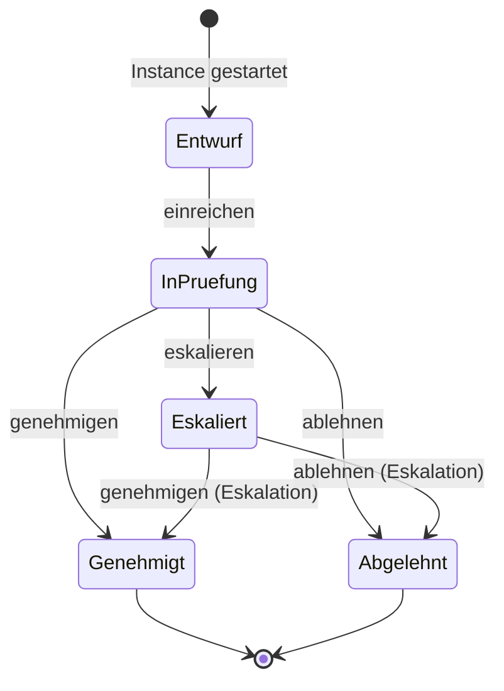

A workflow definition holds states and transitions. An instance is attached to any
entity (project, task, incident, document). Each transition is fired by a named
trigger event, creates a `WorkflowAction` record, moves the SLA log, and optionally
syncs the entity's `workflow_current_state` field.

---

## Use-Case Scenarios

### 1 · Project Inception — Register a new investigation

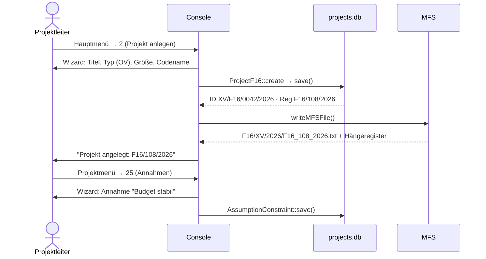

---

### 2 · Staff a project — Add team and assign lead

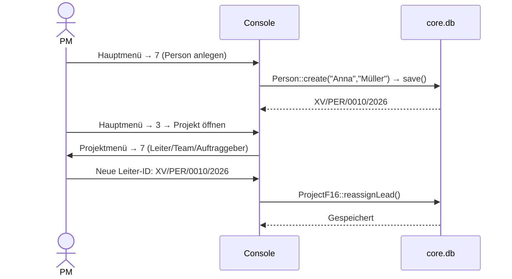

---

### 3 · Task hierarchy — WBS breakdown

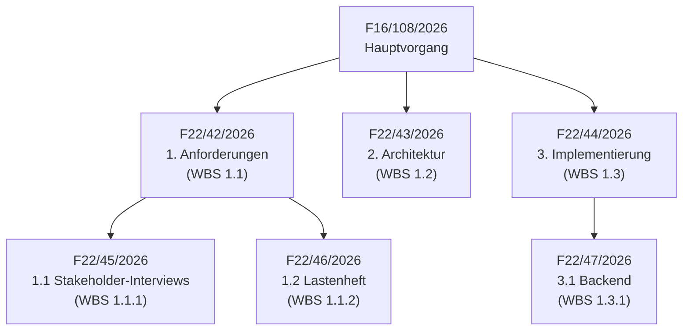

**Console path:** Projekt → 10 (Task anlegen) repeatedly, then each task opened with → 8 (Kind-Task)

---

### 4 · Incident response — Triage, root cause, measure

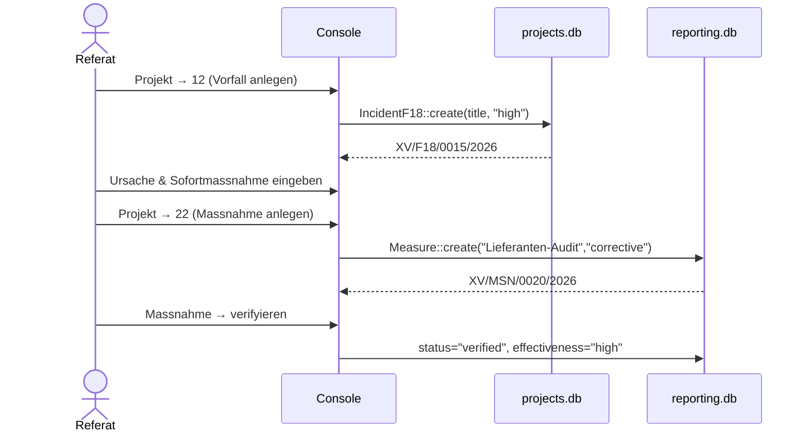

---

### 5 · Risk register — Score, respond, monitor

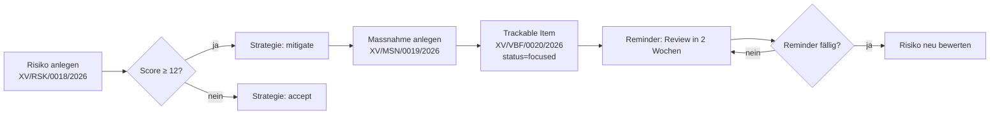

---

### 6 · Document lifecycle — Archive, rename, refile

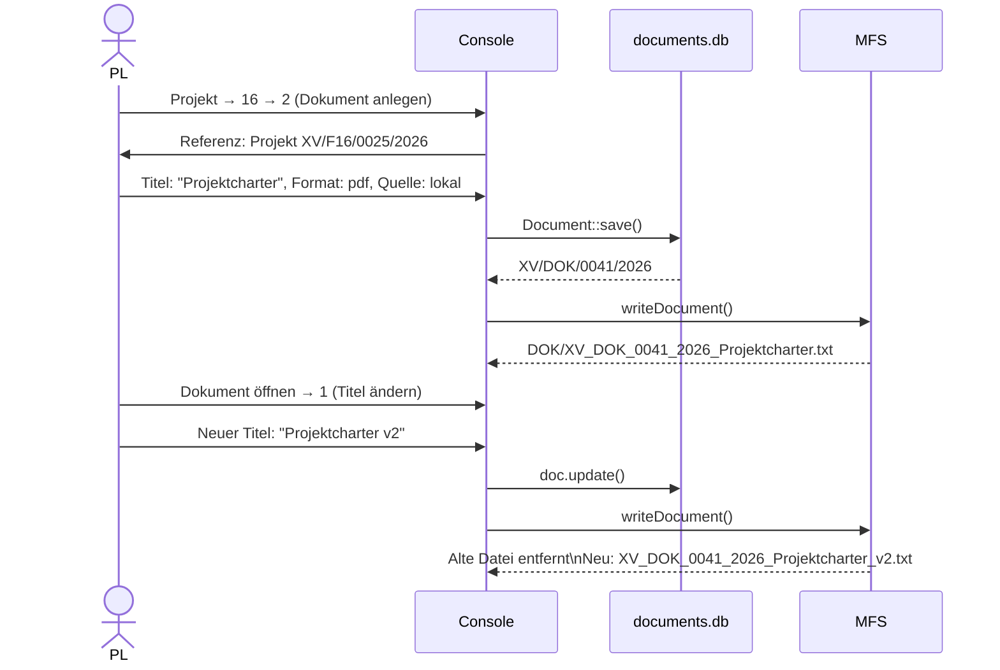

---

### 7 · Approval workflow — Design Review Gate

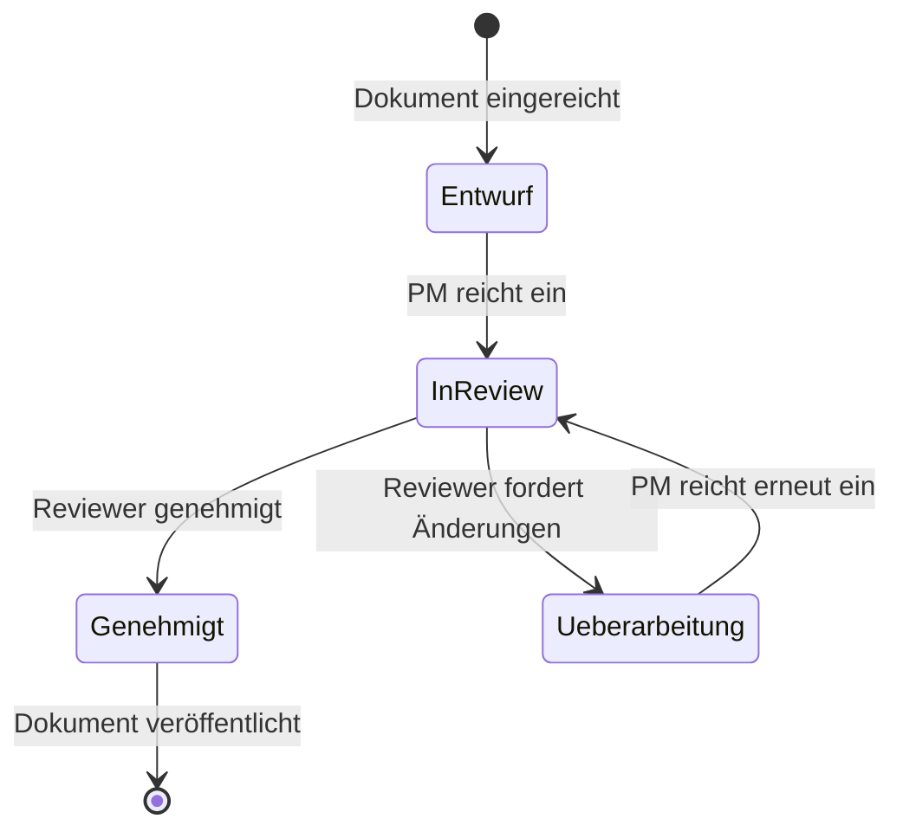

**Steps:** Workflow → 2 (Definition anlegen) → States "entwurf/in_review/genehmigt" → Transitions → 7 (Instanz starten auf Dokument-ID) → 9 (Transition feuern)

---

### 8 · KPI dashboard — Weekly measurement cycle

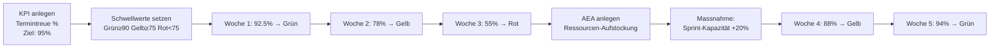

**Console path:** Projekt → 21 → 1 (KPI anlegen) → 2 (Messung eintragen, wöchentlich)

---

### 9 · Change request lifecycle

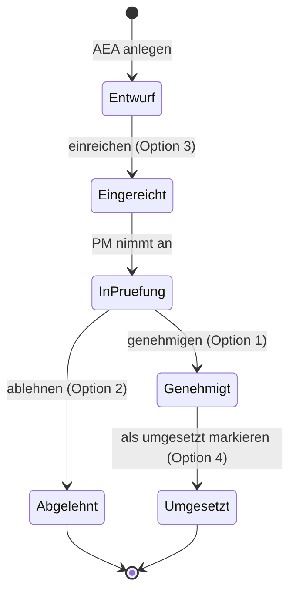

---

### 10 · Lessons Learned — From incident to knowledge base

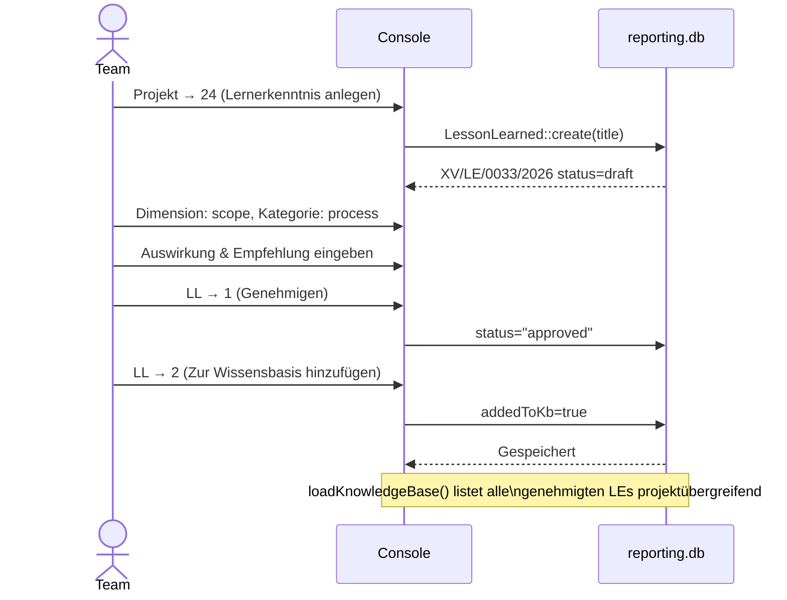

---

### 11 · Milestone gates — Phase control

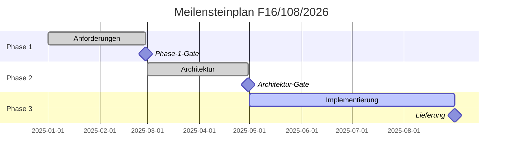

---

### 12 · SLA monitoring — Overdue workflow instances

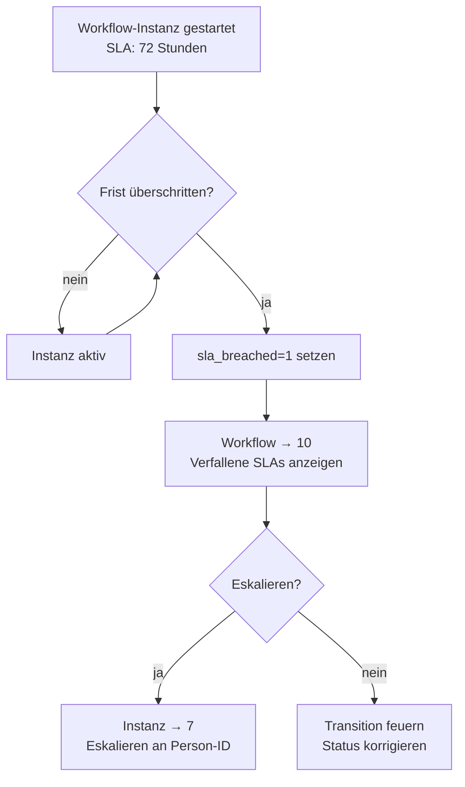

---

### 13 · URL archiving — Web evidence trail

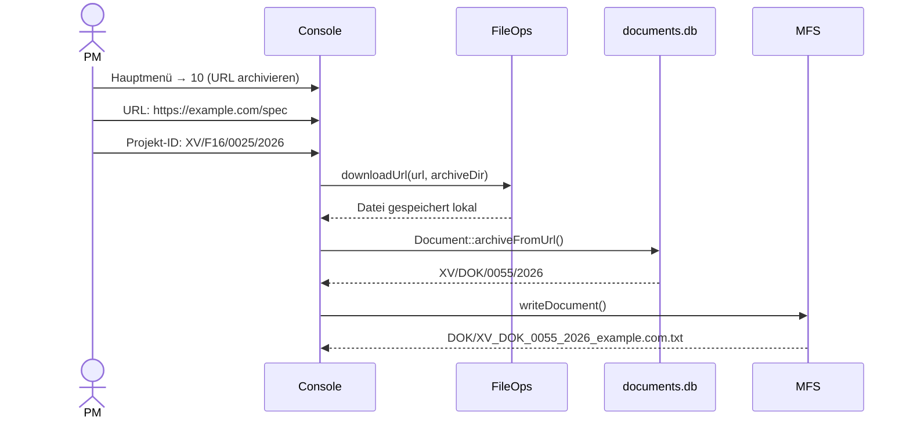

---

### 14 · F16 ↔ F22 conversion — Promote / demote

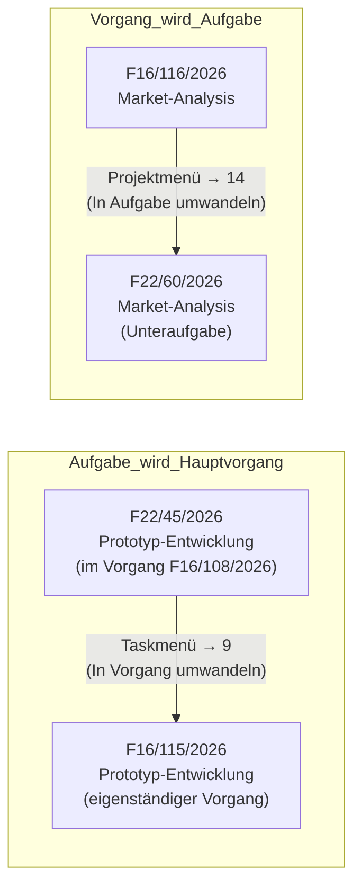

---

### 15 · Team structure — Org hierarchy

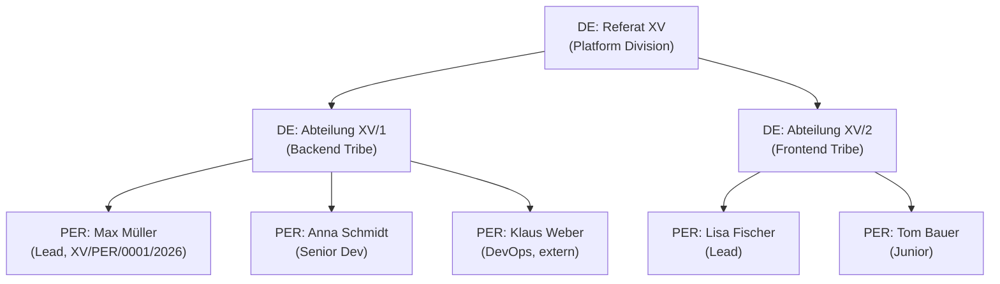

---

### 16 · Quality gate sequence — Release control

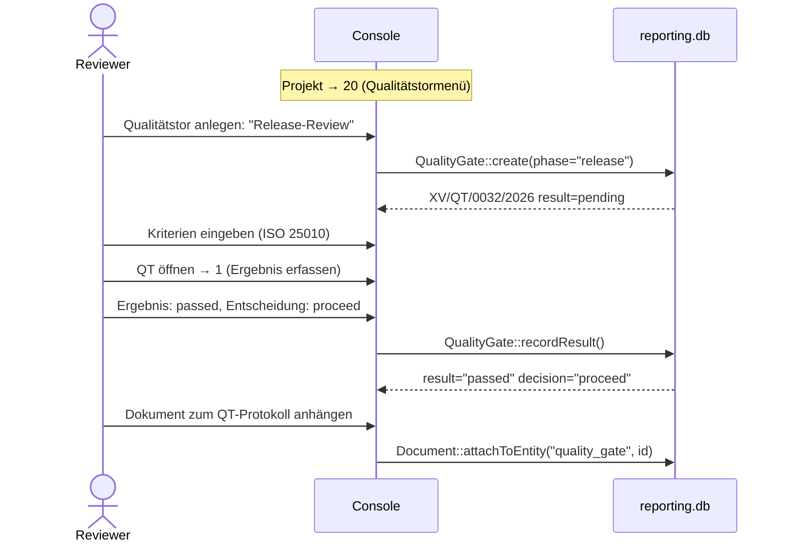

---

### 17 · Decision log — Architecture choice

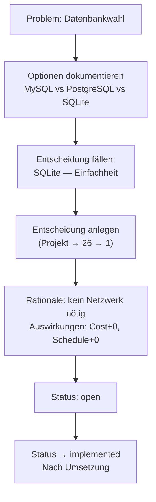

---

### 18 · Assumption breach — Risk realization

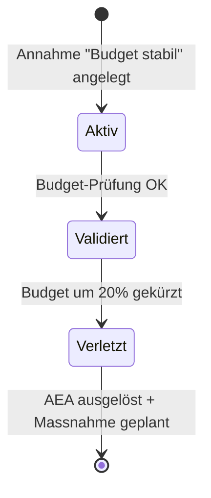

---

### 19 · Parallel workstreams — Multiple projects

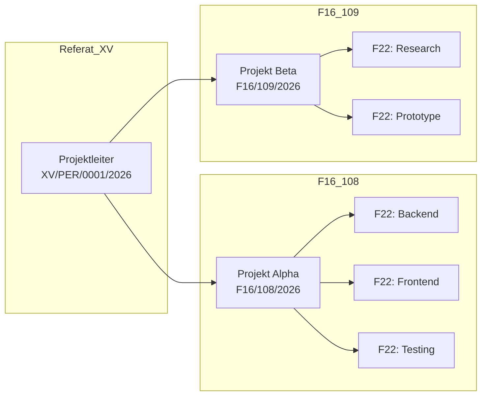

---

### 20 · Backup and recovery flow

```mermaid
flowchart TD
    A[System → 13\nBackup starten] --> B[BackupManager::runFull]
    B --> C[Alle 6 DBs kopiert\nnach backup/db/YYYYMMDD_HHMMSS/]
    B --> D[MFS-Baum kopiert\nnach backup/mfs/YYYYMMDD_HHMMSS/]
    C --> E{maxCopies überschritten?}
    E -->|ja| F[Ältester Backup-Satz\ngelöscht]
    E -->|nein| G[Backup abgeschlossen]
    F --> G
    G --> H[System → 14\nStatus prüfen]
```

---

### 21 · Multi-stakeholder meeting — Minutes workflow

```mermaid
sequenceDiagram
    actor Org as Organisator
    participant Console
    participant proj as projects.db

    Org->>Console: Task öffnen → 12 (Besprechungen)
    Org->>Console: 1 (Besprechung anlegen)
    Org->>Console: Titel: "Architektur-Review"
    Org->>Console: Typ: review, Dauer: 90min, Raum: A.301
    Console->>proj: Meeting::save() → XV/BSP/0030/2026
    Note over Console,proj: Besprechung stattfindet...
    Org->>Console: Besprechung öffnen → 1 (Abschließen)
    Org->>Console: Entscheidungen: "Microservices gewählt"
    Org->>Console: Aktionen: "Klaus: Docker bis 15.03."
    Console->>proj: Meeting::complete()
    proj-->>Console: status="completed"
```

---

### 22 · Evidence chain — Audit trail

```mermaid
flowchart TD
    A[Vorfall F18/24/2026\nDatenqualitätsproblem] --> B[Massnahme MSN/0025/2026\nDaten-Bereinigung]
    A --> C[Risiko RSK/0026/2026\nWiederholungsrisiko]
    C --> D[Massnahme MSN/0027/2026\nValidierungsregel eingeführt]
    B --> E[Dokument DOK/0028/2026\nBereinigungsprotokoll]
    D --> F[Dokument DOK/0029/2026\nValidierungskonzept]
    E --> G[Lernerkenntnis LE/0030/2026\nEingabe-Validierung ab Tag 1]
    F --> G
    G --> H[Wissensbasis]
```

---

### 23 · Sprint planning — Iterative task management

```mermaid
flowchart LR
    A[Sprint-Planung BSP/0031/2026] --> B[Tasks für Sprint auswählen]
    B --> C[WBS-Codes zuweisen\n1.3.1, 1.3.2, 1.3.3]
    C --> D[Aufwand schätzen\n40h / 32h / 24h]
    D --> E[Sprint beginnt]
    E --> F[Verfolgungsblatt\nVBF/0032/2026\nstatus=focused]
    F --> G{Task erledigt?}
    G -->|nein| H[Fortschritt updaten\n% complete]
    H --> G
    G -->|ja| I[status=archived]
    I --> J[Lernerkenntnis falls relevant]
```

---

### 24 · Cost tracking — Budget vs. actual

```mermaid
flowchart TD
    A[Projekt angelegt\nBudget: 500.000€] --> B[Geplanter Wert PV\nerfasst per Task]
    B --> C[Ist-Kosten AC\nper addCost]
    C --> D[Fertigstellungswert EV\nrecalcEarnedValue]
    D --> E[CPI = EV/AC]
    D --> F[SPI = EV/PV]
    E --> G{CPI < 0.9?}
    G -->|ja| H[Warnung: Kostenüberschreitung]
    H --> I[AEA anlegen\nBudgeterhöhung]
    G -->|nein| J[Status OK]
    F --> K{SPI < 0.9?}
    K -->|ja| L[Warnung: Terminverzug]
    L --> M[Meilenstein verschoben?]
    K -->|nein| N[Zeitplan OK]
```

---

### 25 · Vendor due diligence — OPK-style project

```mermaid
sequenceDiagram
    actor RE as Referat
    participant Console
    participant MFS

    RE->>Console: Hauptmenü → 2\nTyp: OPK, Größe: medium
    Console->>Console: ID: XV/F16/0050/2026
    RE->>Console: Person anlegen (Lieferant)
    Console->>Console: XV/PER/0051/2026
    RE->>Console: Dokument: "Zertifikate" anhängen
    Console->>MFS: DOK/XV_DOK_0052_2026_Zertifikate.txt
    RE->>Console: Risiko: "Lieferanten-Insolvenz"
    Console->>Console: XV/RSK/0053/2026 Score=15
    RE->>Console: Entscheidung: "Alternativ-Lieferant benennen"
    Console->>Console: XV/ENT/0054/2026
    RE->>Console: Lernerkenntnis: "Immer Backup-Lieferant"
    Console->>Console: XV/LE/0055/2026 → Wissensbasis
```

---

### 26 · Hotfix process — Emergency incident

```mermaid
flowchart TD
    A[Produktion ausgefallen!] --> B[Vorfall anlegen\nSchwere: critical\nXV/F18/0060/2026]
    B --> C[Eskalation:\nescalated=true\nescalatedTo=XV/PER/0001/2026]
    C --> D[Task anlegen\nHotfix-Implementierung\nXV/F22/0061/2026]
    D --> E[Verfolgungsblatt\nstatus=due\nXV/VBF/0062/2026]
    E --> F[Hotfix deployed]
    F --> G[Vorfall: status=resolved]
    G --> H[Root cause: Massnahme\nXV/MSN/0063/2026]
    H --> I[Post-Mortem Dokument\nXV/DOK/0064/2026]
    I --> J[Lernerkenntnis\nXV/LE/0065/2026]
```

---

### 27 · Archive workflow — Project closure AU

```mermaid
sequenceDiagram
    actor PM
    participant Console
    participant proj as projects.db

    PM->>Console: Projekt öffnen → 2 (Status ändern)
    PM->>Console: Status: "closed"
    Console->>proj: update()
    PM->>Console: Projekt → 24 (Lessons Learned)\nAbschluss-Rückschau
    PM->>Console: Projekt → 26 (Entscheidungslog)\nAbschluss-Entscheidungen
    PM->>Console: System → 12 (MFS-Baum neuerstellen)
    Console->>proj: MFSWriter::rebuildAll()
    PM->>Console: System → 13 (Backup)
    Console->>Console: Alle 6 DBs + MFS gesichert
    Note over PM,Console: Vorgang in physischen Archiv\nAU-Ordner übertragen
```

---

### 28 · Dependency chain — Critical path

```mermaid
flowchart LR
    T1["F22/70: Requirements\n(WBS 1.1)\nfertig: 28.02"] --> T2["F22/71: Design\n(WBS 1.2)\nstart: 01.03"]
    T2 --> T3["F22/72: Implement\n(WBS 1.3)\nstart: 15.03"]
    T3 --> T4["F22/73: Testing\n(WBS 1.4)\nstart: 01.05"]
    T4 --> M1["MEI/0074\nRelease-Gate\n31.05.2025"]
    T1 --> D1["F22/75: Dokumentation\n(parallel)\nläuft mit T2-T4"]
    D1 --> M1
```

---

### 29 · Multi-approver workflow — Procurement approval

```mermaid
stateDiagram-v2
    [*] --> Beantragt : AEA eingereicht
    Beantragt --> Fachpruefung : Fachabteilung prüft
    Fachpruefung --> Budgetpruefung : Fach genehmigt
    Fachpruefung --> Abgelehnt : Fach lehnt ab
    Budgetpruefung --> Genehmigt : Budget vorhanden
    Budgetpruefung --> Eskaliert : Budget fehlt
    Eskaliert --> Genehmigt : Führung genehmigt Sonderbudget
    Eskaliert --> Abgelehnt : Führung lehnt ab
    Genehmigt --> [*]
    Abgelehnt --> [*]
```

---

### 30 · Configuration — Change department code

```mermaid
flowchart TD
    A[settings.json öffnen] --> B[registratur.diensteinheitKuerzel\nÄndern: XV → HA/I]
    B --> C[Programm neu starten]
    C --> D[Alle neuen IDs:\nHA/I/F16/0001/2027]
    D --> E[Bestehende IDs\nbleiben unverändert]
    E --> F[MFS-Baum neuerstellen\nSystem → 12]
    F --> G[Neue Ordner unter\nmfs/F16/HA_I/2027/]
```

---

### 31 · Scope management — Change impact analysis

```mermaid
flowchart TD
    A[Neuer Stakeholder-Wunsch] --> B[AEA anlegen\n"API-Erweiterung"\nXV/AEA/0080/2026]
    B --> C[Auswirkungen analysieren]
    C --> D[Zeitauswirkung: +14 Tage]
    C --> E[Kostenauswirkung: +8.000€]
    C --> F[Qualitätsauswirkung: kein]
    D --> G[Meilenstein verschoben?\nMEI/0074 → 14.06.]
    E --> H[Budget-Reserve prüfen]
    G --> I{Genehmigt?}
    H --> I
    F --> I
    I -->|ja| J[AEA: approved\nMeilenstein updaten\nBudget updaten]
    I -->|nein| K[AEA: rejected\nAnnahme beibehalten]
```

---

### 32 · Knowledge transfer — Cross-project learning

```mermaid
sequenceDiagram
    participant P1 as Projekt Alpha
    participant KB as Wissensbasis
    participant P2 as Projekt Beta

    P1->>KB: LE/0033: "React bevorzugen"
    P1->>KB: LE/0034: "CI/CD von Tag 1"
    P1->>KB: LE/0035: "Stakeholder wöchentlich"
    Note over KB: LessonLearned::loadKnowledgeBase()
    P2->>KB: Wissensbasis abrufen
    KB-->>P2: 3 Lernerkenntnisse
    P2->>P2: Annahmen setzen (ABE)\nauf Basis der LEs
    P2->>P2: Meilensteine früher setzen
```

---

### 33 · Resource allocation — Team capacity planning

```mermaid
flowchart LR
    subgraph Diensteinheit_XV
        P1["XV/PER/0001\nMax Müller\n100% verfügbar"]
        P2["XV/PER/0002\nAnna Schmidt\n80% verfügbar"]
        P3["XV/PER/0003\nKlaus Weber\n50% verfügbar (extern)"]
    end
    subgraph Projekte
        F1["F16/108/2026\nAlpha\n Lead: Max"]
        F2["F16/109/2026\nBeta\n Lead: Anna"]
    end
    P1 --> F1
    P2 --> F1
    P2 --> F2
    P3 --> F2
```

---

### 34 · Contract document trail — Vertragsverwaltung

```mermaid
sequenceDiagram
    actor PM
    participant Console
    participant doc as documents.db
    participant MFS

    PM->>Console: Projekt → 16 → 2 (Dokument)
    PM->>Console: Typ: contract, Kategorie: legal
    PM->>Console: Version: 1.0, Sprache: DE
    PM->>Console: Klassifikation: VS-NfD
    Console->>doc: Document::save() → XV/DOK/0090/2026
    Console->>MFS: XV_DOK_0090_2026_Rahmenvertrag.txt
    PM->>Console: Genehmiger: XV/PER/0005/2026
    PM->>Console: Ablaufdatum: 2027-12-31
    Console->>doc: approvedBy, dateExpires gesetzt
    Note over MFS: Datei mit chmod 600 abgelegt
```

---

### 35 · Agile adaptation — Sprint-Vorgänge

```mermaid
flowchart TD
    A[Hauptvorgang F16/100/2026\nProduct Backlog] --> B[Sprint 1: F22/80/2026\nMeilenstein: Sprint-1-Review]
    A --> C[Sprint 2: F22/85/2026]
    A --> D[Sprint 3: F22/90/2026]
    B --> B1[Story 1.1: F22/81\nWBS S1.1]
    B --> B2[Story 1.2: F22/82\nWBS S1.2]
    B --> BM[MEI: Sprint-1-Review\n15.02.2025\nstatus: achieved]
    C --> C1[Story 2.1: F22/86]
    C --> CM[MEI: Sprint-2-Review\n01.03.2025]
```

---

### 36 · Compliance audit — Prüfpfad

```mermaid
flowchart TD
    A[Audit-Anfrage] --> B[MFS-Baum öffnen\nF16/XV/2026/]
    B --> C[Karteikarte F16_108_2026.txt\nAktenzeichen: GZ-F16_108_2026]
    C --> D[Hängeregister\nF16_108_2026/]
    D --> E[DOK/ alle Dokumente\nID-Sortierung eindeutig]
    D --> F[ENT/ Entscheidungsprotokoll]
    D --> G[AEA/ Änderungsanträge\nGenehmigungsstatus]
    D --> H[LE/ Lernerkenntnisse]
    E --> I[owner_key.txt\nKlarname-Zuordnung]
    I --> J[Vollständiger Prüfpfad]
```

---

### 37 · Notification system — Fälligkeiten

```mermaid
flowchart LR
    A[Reminder anlegen\nVBF/0022/2026\nTrigger: 2025-03-14] --> B{Datum erreicht?}
    B -->|nein| B
    B -->|ja| C[isDue() = true]
    C --> D[Workflow → 11\nAusstehende Benachrichtigungen]
    D --> E{Bestätigen?}
    E -->|ja| F[Alle als gesendet markieren]
    E -->|nein| G[Später erledigen]
    F --> H[dismissed=true\ndismissedAt gesetzt]
```

---

### 38 · External consultant — Contractor onboarding

```mermaid
sequenceDiagram
    actor HR
    participant Console
    participant core as core.db

    HR->>Console: Hauptmenü → 7 (Person anlegen)
    HR->>Console: Typ: contractor, Tagessatz: 850€
    HR->>Console: Verfügbarkeit: 60%
    Console->>core: XV/PER/0095/2026
    HR->>Console: Team öffnen → Mitglied hinzufügen
    HR->>Console: Rolle: "Senior Consultant"
    HR->>Console: Mitgliedstyp: extended
    HR->>Console: Allokation: 60%
    Console->>core: TeamMember saved
    HR->>Console: Projekt → 7\nLeiter-ID setzen
    Note over Console: Name nur in owner_key.txt\nAlle anderen Dateien: ID
```

---

### 39 · MFS rebuild after migration — Vollständige Neuindizierung

```mermaid
sequenceDiagram
    actor SA as Systemadmin
    participant Console
    participant DB as 6x SQLite
    participant MFS

    SA->>Console: System → 12 (MFS-Baum neu erstellen)
    Console->>DB: ProjectF16::loadAll()
    DB-->>Console: N Projekte
    loop Jedes Projekt
        Console->>MFS: writeProject() → Karteikarte + Hängeregister
        Console->>DB: TaskF22::loadForProject()
        loop Jede Aufgabe
            Console->>MFS: writeTask() → F22/ + standalone
        end
        Console->>DB: IncidentF18::loadForProject()
        loop Jeder Vorfall
            Console->>MFS: writeIncident() → F18/ + standalone
        end
    end
    Console->>MFS: owner_key.txt neuschreiben
    Console->>SA: "MFS rebuild complete. OK=yes"
```

---

### 40 · Full project lifecycle — Von Initiierung bis Archiv

```mermaid
flowchart TD
    A[Initiierung\nVorgang anlegen\nF16/108/2026] --> B[Planung\nWBS + Tasks\nMeilensteine\nRisiken\nAnnahmen]
    B --> C[Durchführung\nTasks bearbeiten\nMeetings\nDokumente\nVorfälle]
    C --> D{Qualitätstor\nbestanden?}
    D -->|nein| E[Feststellungen\nKorrektiv-Massnahmen]
    E --> C
    D -->|ja| F[Lieferung\nMeilenstein: achieved]
    F --> G[Abschluss\nLernerkenntnisse\nEntscheidungslog\nLetzter Backup]
    G --> H[Archiv\nStatus: closed\nMFS-Ordner vollständig]
    H --> I[AU-Transfer\nmfs/AU/]

    style A fill:#2d4a7a,color:#fff
    style H fill:#4a2d2d,color:#fff
    style D fill:#7a6a2d,color:#fff
```

---

## Configuration Reference

`settings.json`:

```json
{
    "basePath": "/path/to/your/onedrive/rosenholz",
    "projectName": "Mein Referat",
    "logLevel": "INFO",
    "registratur": {
        "diensteinheitKuerzel": "XV",
        "aktenfuehrendeStelle": "Rosenholz-Referat XV",
        "geschaeftszeichen": "GZ",
        "archivSignatur": "BStU-MfS"
    },
    "backup": {
        "enabled": false,
        "intervalHours": 24,
        "maxCopies": 7,
        "backupPath": ""
    },
    "mfs": {
        "enabled": true,
        "rootFolder": "mfs"
    },
    "db": {
        "walMode": true,
        "cacheSize": -64000
    }
}
```

**Key settings:**

| Key | Description |
|-----|-------------|
| `basePath` | Root directory for all data — set to your OneDrive folder for sync |
| `registratur.diensteinheitKuerzel` | Department code prefix for all IDs (`XV`, `HVA`, `HA/I`, ...) |
| `registratur.geschaeftszeichen` | Business sign appearing in DECKBLATT Aktenzeichen field |
| `backup.maxCopies` | How many timestamped backup sets to keep before pruning |
| `mfs.enabled` | Toggle physical file output (databases always written regardless) |

---

## Qt/QML Integration

The model layer has **zero Qt dependencies**. To wrap for a QML UI:

```cpp
// In your Qt application:
#include "src/app/AppController.h"

// Before QApplication:
Rosenholz::AppController::instance().init(
    "settings.json", "",
    Rosenholz::AppMode::UI
);

// Route log output to QML:
Rosenholz::AppController::instance().setQtLogCallback(
    [](const std::string& msg) {
        emit logMessage(QString::fromStdString(msg));
    }
);
```

All model classes are plain C++17 PODs with `std::shared_ptr` factory methods.
Wrap them as `QObject` subclasses in a `QmlBridge` layer and expose via
`QAbstractListModel` for `ListView`/`TableView`.

---

*Rosenholz PM — Ordnung ist das halbe Leben.*
